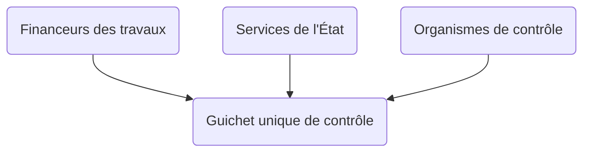

# @renolab/controle

Ce projet a pour objectif de proposer une guichet unique des contrôles des travaux de rénovation énergétique à destination des financeurs (obligés, délégataires, anah) et des organismes de contrôles agréés.

## Synthèse

### Objectifs

- 🎯 Proposer un service numérique de contrôle des travaux de rénovation énergétique
- 🎯 Proposer un référentiel commun de contrôle
- 🎯 Proposer un modèle standard d'échange de données relatives aux contrôles

### Usages

- 👉 Contrôle des opérations de rénovation énergétique avant dépôt (doctrine CEE)
- 👉 Contrôle des opérations de rénovation énergétique après paiement (MPR)

### Livrables

- 🛠️ Standard d'échange de données au format JSON Schema
- 🛠️ API métier de contrôle des travaux de rénovation énergétique
- 🛠️ Application métier de contrôle des travaux de rénovation énergétique

### Budget

**⚠️ Ce projet n'est pas financé pour le moment et est porté bénévolement**

### Contact

[Adrien Rosi Dit Rozzi](https://www.linkedin.com/in/adrienrosi/)

## Feuille de route

1. Définition d'un modèle standard des données
2. Définition des règles de cohérence métier
3. Définition d'une documentation API
4. Développement et déploiement d'une API
5. Développement et déploiement d'une application
