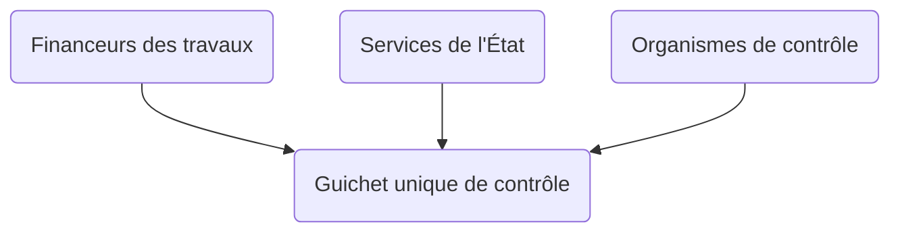

# @renolab/controle

Ce projet a pour objectif de proposer une guichet unique des contrôles des travaux de rénovation énergétique à destination des financeurs (obligés, délégataires, anah) et des organismes de contrôles agréés.

## Synthèse

### Objectifs

🎯 Proposer un service numérique de contrôle des travaux de rénovation énergétique  
🎯 Proposer un référentiel commun de contrôle  
🎯 Proposer un modèle standard d'échange de données relatives aux contrôles  

### Usages

👉 Contrôle des opérations de rénovation énergétique avant dépôt (doctrine CEE)  
👉 Contrôle des opérations de rénovation énergétique après paiement (MPR)  

### Budget

**⚠️ Ce projet n'est pas financé pour le moment et est porté bénévolement**

### Contact

[Adrien Rosi Dit Rozzi](https://www.linkedin.com/in/adrienrosi/)

## Feuille de route

1. Définition du périmètre du projet
2. Proposition d'un modèle standard de contrôle
3. Définition des règles métier
4. Conception du design API
5. Développement et déploiement d'une API
6. Développement et déploiement d'une application

### 1. Définition du périmètre du projet

**Les types de contrôles**

La typologie de contrôle utilisée dans le cadre du dispositif des Certificats d'Economies d'Energie est reprise :

- Contrôle sur le lieu de l'opération
- Contrôle par contact avec le bénéficiaire de l'opération

>Est considéré comme un contrôle sur le lieu de l'opération un contrôle effectué avec le déplacement physique de la >personne chargée du contrôle sur le lieu de réalisation de l'opération indiqué par le bénéficiaire de celle-ci.
>Est considéré comme un contrôle par contact un contrôle effectué par téléphone, par courrier, par messagerie >électronique ou au moyen d'un autre outil numérique avec le bénéficiaire de l'opération d'économies d'énergie.
>
> Source : [Article 2 de l'arrêté du 28 septembre 2021 relatif aux contrôles dans le cadre du dispositif des certificats d'économies d'énergie](https://www.legifrance.gouv.fr/jorf/id/JORFTEXT000044162840)

**Les organismes de contrôle**

**🕰️ A venir**

**Les opérations à contrôler**

**🕰️ A venir**

### 2. Proposition d'un modèle standard de contrôle

**🕰️ A venir**

### 3. Définition des règles métier

**🕰️ A venir**

### 4. Conception du design API

**🕰️ A venir**

### 5. Développement et déploiement d'une API

**🕰️ A venir**

### 6. Développement et déploiement d'une application

**🕰️ A venir**
